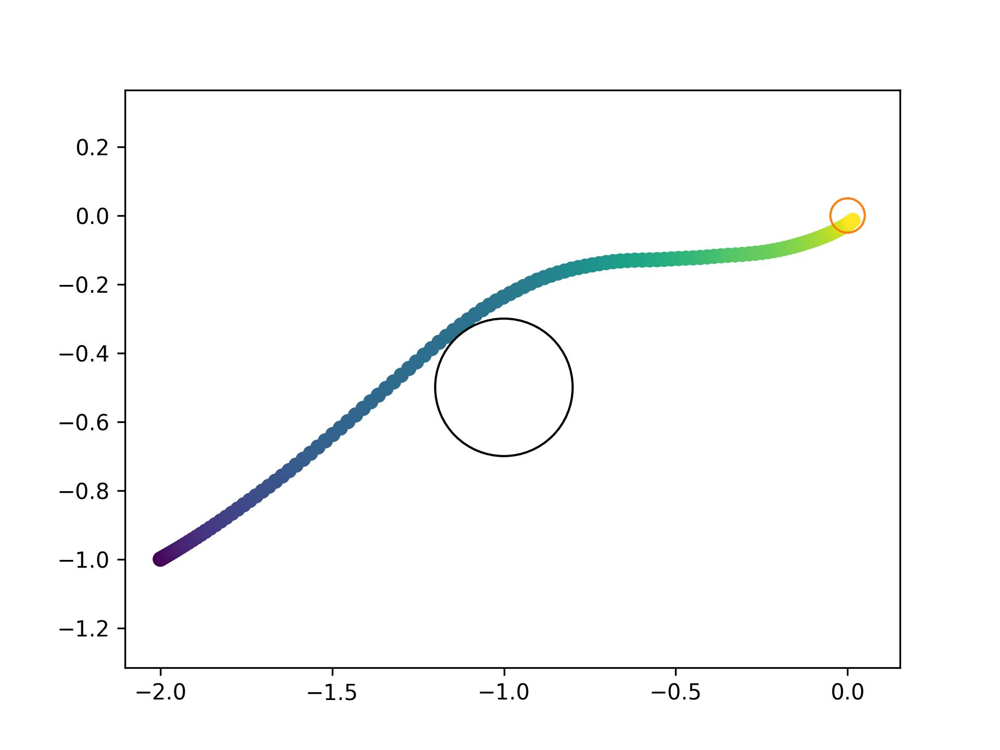
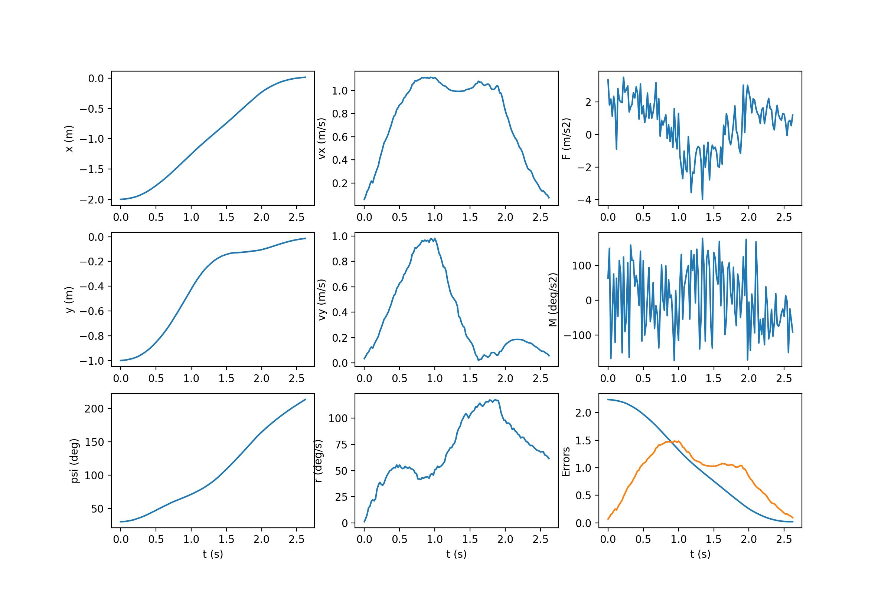

# jax-mppi
A simple implementation of Model Predictive Path Integral (MPPI) control in JAX. `jit` compilation allows for $30 - 100\times$ speedups over pytorch implementations. The speedup is particularly noticeable for neural network dynamics.

## Model Predictive Path Intgral (MPPI) Control
### Background
For a general system
$$x_{t+1} = F(x_t, v_t)$$
with state $x_t \in \mathbb{R}^n$ and input $v_t \in \mathbb{R}^m$, assume that $v_t$ represents the output of a low-level controller described by
$$v_t \sim \mathcal{N}(u_t, \bar \Sigma)$$

Encode the desired performance in a running cost function $\mathcal{L}(x_t, u_t)$ and terminal cost $\phi(x_T)$. This gives the optimal control problem
```math
U^\star = \arg\min_{U\in\mathcal{U}} \mathbb{E}_{\mathbb{Q}_{U,\Sigma}}
\left[ \phi(x_T) + \sum_{t=0}^{T-1}{\mathcal{L}(x_t, u_t)} \right]
```
where the solution $U^\star$ is the control sequence that minimizes the expected cost (running cost + terminal cost), subject to stochasticity in the low-level controller parameterized by $U,\bar\Sigma$.

The state-cost is defined as
```math
S(V; x_0) = C(\mathcal{H}(V; x_0))
```
with control sequence $V \in \mathbb{R}^{m \times T}$, 
state-dependent portion of the running-cost $C$,
trajectory operator $\mathcal{H}$ which converts sequence of actions to trajectories, and initial state $x_0$.

### Intuition
MPPI is an information-theoretic solution to the optimal control problem. It is highly parallelizable on modern GPUs, making it an attractive method for complex systems.

The core result that allows for the MPPI algorithm is a derivation of the *free-energy* of a system as a lower bound for the *optimal control cost*. This results allows the optimal control to be computed by minimizing the KL divergence between the current distribution and optimal distribution. The optimal distribution is approximated via importance sampling.

### Free Energy
The **free-energy** of a system is defined as
```math
\mathcal{F}(S,p,x_0,\lambda) = 
\log \left(
    \mathbb{E}_\mathbb{P} \left[
        \exp \left( - \frac{1}{\lambda} S(V) \right)
    \right]
\right)
```
with inverse temperature $\lambda \in \mathbb{R}^+$, uncontrolled (base) control distribution $\mathbb{P}$.

### Optimal Control Distribution
Using the free-energy as a lower bound on optimal control cost, the optimal control problem can be optimized by computing an optimal distribution for the controls.
This implies that "pushing" a controlled distribution $\mathbb{Q}_{U,\Sigma}$ toward the optimal distribution $\mathbb{Q}^\star$ will achieve the solution to the optimal control problem $U^\star$.

This can be formalized as
```math
U^\star = \arg\min_{U \in \mathcal{U}} \left[
    \mathbb{D}_{KL}(
        \mathbb{Q}^\star \| \mathbb{Q}_{U,\Sigma}
    )
\right]
```
minimizing the KL divergence between the controlled and optimal distributions.

### Importance sampling
The optimal control sequence is the expectation of trajectories sampled from the optimal distribution $\mathbb{Q}^\star$. This expectation can be constructed via *importance sampling*, which allows the estimation of a distribution using samples from another distribution.

The weighting term
```math
w(V) = \frac{q^\star(V)}{q(V | \hat U, \Sigma)}
```
allows us to compute the expectation w.r.t $\mathbb{Q}^\star$ using samples from $\mathbb{Q}_{\hat U,\Sigma}$.

### Information-Theoretic Control Law
The final control law is
```math
\begin{aligned}
w(V) &= \frac{1}{\eta} \exp \left(
-\frac{1}{\lambda} \left(
    S(V) + \lambda \sum_{t=0}^{T-1} (\hat u_t - \tilde u_t)^T \Sigma^{-1} v_t
\right) \right) \\
u_t &= \mathbb{E}_{\mathbb{Q}_{\hat U, \Sigma}}[w(V) v_t]
\end{aligned}
```

## Simulation Results
### Dynamics
For the system
```math
\begin{bmatrix}
\dot x \\ \dot y \\ \dot \psi \\
\dot v_x \\ \dot v_y \\ \dot r
\end{bmatrix} =
\begin{bmatrix}
v_x \\ v_y \\ r \\
F \cos(\psi) - C_d v_x \\
F \sin(\psi) - C_d v_y \\
M
\end{bmatrix}
```
With position $x,y$, heading angle $\psi$, velocities $v_x, v_y$, heading rate $r$. The inputs are force $F$ and moment $M$.

| Paramter | Value |
| --- | --- |
| $T$ | $100$ |
| $N$ | $5000$ |
| dt | $1 / 50$ |
| $\lambda$ | $10.0$ |
| $\Sigma$ | $\text{diag}([5.0, 10.0])$ |
| $\gamma$ | $0.1$ |

The dynamics are approximated by a MLP with $2$ layers of dimension $256$.

<p align="center">
    
</p>

<p align="center">
    
</p>